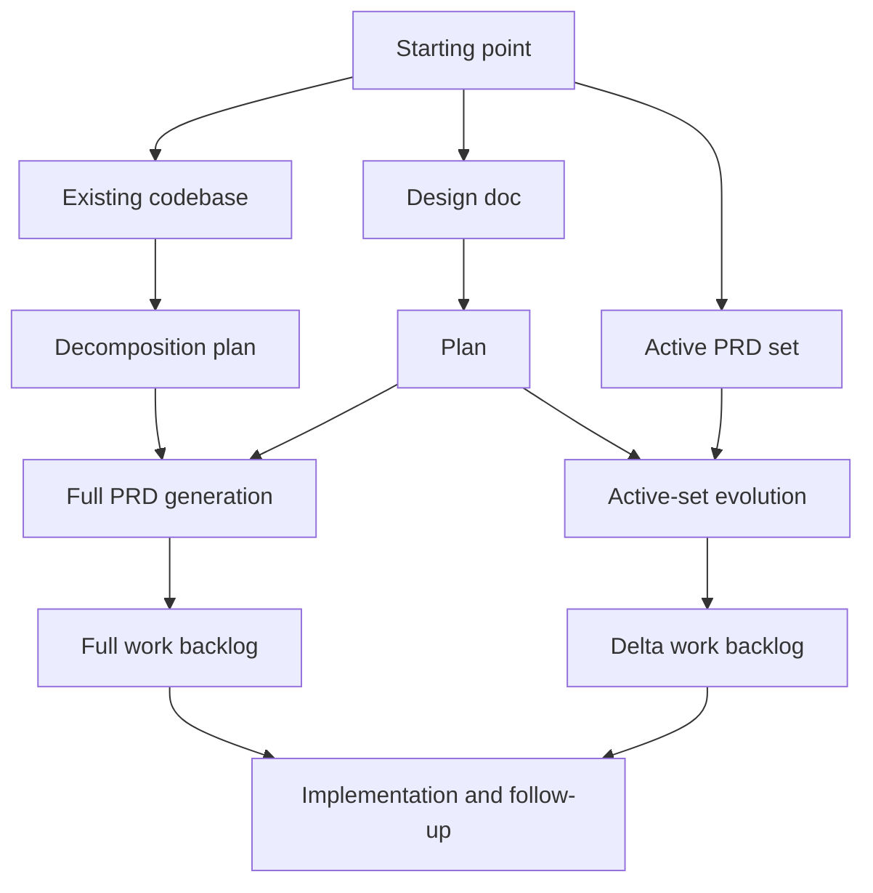

# Understanding the Make Docs Stage Model

> See `docs/assets/references/guide-contract.md` for frontmatter schema and slug rules.

## Overview

`make-docs` does not force one linear workflow for every project. It provides a small set of stages and artifact types that can be combined in different ways depending on what you already have and what you need next.

The main idea is:

- designs capture intent and route downstream planning
- plans make execution decision-complete
- PRDs describe the active product and requirement set
- work backlogs translate PRD decisions into dependency-ordered delivery work

Decomposition fits into that model as a way to generate a fresh PRD set from an existing codebase, not as a mandatory stage that every project must go through.

## Prerequisites

This guide assumes you already know the top-level artifact families in the repo:

- `docs/designs/` for design intent
- `docs/plans/` for execution planning
- `docs/prd/` for the active PRD namespace
- `docs/work/` for delivery backlogs
- `docs/assets/history/` for point-in-time history records

Read this guide before authoring or updating lifecycle docs so you choose the right route instead of forcing everything through a single pattern.

## Setup / Configuration

Use these reference files as the authority for each part of the lifecycle:

| Topic | Source of truth |
| --- | --- |
| Design routing and handoff | [design-workflow.md](../../assets/references/design-workflow.md) |
| Planning expectations | [planning-workflow.md](../../assets/references/planning-workflow.md) |
| Execution modes and writing order | [execution-workflow.md](../../assets/references/execution-workflow.md) |
| Active PRD shape and backlog coupling | [output-contract.md](../../assets/references/output-contract.md) |
| PRD change docs and annotations | [prd-change-management.md](../../assets/references/prd-change-management.md) |
| W/R lineage rules for plans and work | [wave-model.md](../../assets/references/wave-model.md) |

Two details are easy to miss:

1. Designs route into planning through `baseline-plan` or `change-plan`, and the explicit route should be treated as authoritative unless the user overrides it.
2. PRDs are exempt from W/R numbering. Plans and work use W/R lineage; designs and PRDs do not.

## Usage

### Stage and artifact relationships

#### Design

Design docs are where a project or change explains intent, alternatives, consequences, and the intended downstream route.

- Use a design when the main question is "what should we do and why?"
- A design can feed a fresh baseline planning path or a change-oriented planning path.
- Designs are inputs to a wave cycle, not outputs of one.

The key downstream handoff is `## Intended Follow-On`:

- `baseline-plan` means the design should feed fresh baseline planning
- `change-plan` means the design should feed additive or revising work against the active PRD namespace

#### Plan

Plans are decision-complete execution specs. They settle output shape, routing, workstreams, and validation before writing starts.

- Plans always live in W/R directories under `docs/plans/`
- Plans can target baseline PRD generation, decomposition, or PRD change work
- Plans are where the system decides whether the task is a fresh PRD set or active-set evolution

In practice, planning is the stage that answers "what exact docs and backlog will execution produce?"

#### PRD

The PRD namespace is the active product knowledge base for the repo.

- `docs/prd/` holds exactly one active PRD namespace at a time
- the fixed core is always `00` through `04`
- adaptive docs begin at `05` and can be baseline subsystem/reference docs or numbered change docs

PRDs operate in two modes:

| Mode | What it means | Typical output |
| --- | --- | --- |
| `full-set generation` | Create or replace the active PRD namespace as a set | Core docs plus adaptive baseline docs |
| `active-set evolution` | Keep the active namespace and extend or revise it in place | Numbered change docs plus baseline annotations |

This is where greenfield, iterative, and decomposed flows converge:

- greenfield work usually generates a full baseline PRD set
- decomposition generates a fresh PRD set from an existing codebase
- iterative change work evolves the active set with change docs and annotations

#### Work backlog

Work backlogs are downstream from PRD work, not parallel alternatives to it.

- full-set generation produces a full backlog directory under `docs/work/`
- active-set evolution produces a new dated delta backlog directory by default
- every work phase must link back to its source PRD docs

That coupling matters because the backlog is supposed to implement the effective requirements, not bypass them.

#### Decomposition

Decomposition is a route, not a universal stage.

Use decomposition when:

- the product already exists in code
- the repo lacks an adequate PRD set
- you need a clean-room understanding of what the system does before planning future work

Decomposition usually flows like this:

1. inspect the existing codebase
2. plan decomposition
3. generate a fresh PRD set
4. generate a rebuild backlog

That is different from iterative product work, where an active PRD set already exists and only targeted change docs are needed.

### Lifecycle rules that shape implementation

#### Plans and work use W/R lineage

Plans and work directories use the wave model because they represent initiatives and revisions to initiatives. W/R helps answer:

- is this a new end-to-end initiative?
- is this a revision to an earlier initiative?
- which backlog belongs to which planning cycle?

#### Designs and PRDs do not

Designs are dated, topic-first artifacts. PRDs evolve in place as a namespace.

That distinction is intentional:

- a design can feed different downstream paths without needing wave identity in its filename
- a PRD set should remain the active requirement surface instead of fragmenting into multiple wave-specific copies

#### Full-set generation has an archive gate

If `docs/prd/` already contains active root entries and you want to generate a fresh PRD set, execution must stop and ask for archival approval first. On approval, the old set moves to `docs/assets/archive/prds/YYYY-MM-DD/` or a suffixed variant.

#### Active-set evolution does not archive the active set

When a requirement is added, enhanced, revised, deprecated, or removed inside the current namespace:

- keep the active baseline docs in place
- append new numbered change docs
- annotate affected baseline sections with `### Change Notes`
- update `00-index.md` so lineage and status remain readable

### What this means for contributors and agents

When extending the system, think in terms of lifecycle intent first:

- add or update a design route when the downstream choice changes
- add or update a planning template when execution needs different decisions up front
- add or update PRD/change contracts when the active knowledge model changes
- add or update work backlog behavior when delivery outputs or traceability rules change

Do not collapse these concerns into a single "project documentation" bucket. The model stays flexible because each stage has a different job.

## Troubleshooting

### "Should every project start with a design?"

No. A design is natural when intent is unresolved or multiple routes are plausible. A decomposition flow can begin from an existing codebase. Iterative work can begin from an active PRD set.

### "Is decomposition just another name for planning?"

No. Decomposition is a reverse-engineering route that typically results in fresh PRD generation and a rebuild backlog. Planning is the decision-complete step that decides how execution should proceed.

### "Why is the backlog not treated as the source of truth?"

Because the backlog is downstream execution guidance. The PRD set is the requirement surface; the backlog is the delivery plan derived from it.

### "Why do plans and work use W/R, but PRDs do not?"

Plans and work represent initiative lineage. PRDs represent the active product knowledge base. Mixing those concerns would make iterative PRD maintenance harder, not easier.

## Related Resources

- Use [Choosing the Right Make Docs Route](./development-workflows-choosing-the-right-route.md) when you already understand the artifact model and need to pick the right workflow for a specific situation.
- Use the companion user guide [How Make Docs Stages Fit Together](../user/workflows-how-make-docs-stages-fit-together.md) when you need a lighter explanation for support, onboarding, or end-user docs.
- Use [Understanding W/R/P Coordinates](../user/concepts-wave-revision-phase-coordinates.md) for the detailed rules behind wave and revision lineage.
