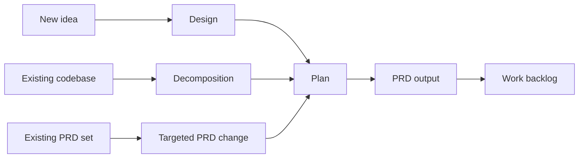

# How Make Docs Stages Fit Together

> See `docs/assets/references/guide-contract.md` for frontmatter schema and slug rules.

## Overview

`make-docs` is flexible on purpose. A project does not have to start from the same place every time.

You might start from:

- a new idea that needs a design
- an existing codebase that needs better documentation
- an active PRD set that needs to be updated

What stays consistent is the job of each stage:

- design explains intent
- planning decides the route and outputs
- PRDs describe the active product requirements
- work backlogs turn those requirements into delivery steps

## Prerequisites

This guide is for people trying to understand the overall system, not for people who need internal implementation details.

If you also need help with the wave and revision naming used by plans and work backlogs, read [Understanding W/R/P Coordinates](./concepts-wave-revision-phase-coordinates.md).

## Getting Started

Think about `make-docs` as a set of routes instead of a single rigid pipeline.

### Design

Use design work when you are deciding what should exist and why.

This is most useful when:

- the project is still taking shape
- there are multiple valid approaches
- the team needs to agree on intent before writing product docs or backlog work

### Plan

Planning decides what happens next.

It turns the current situation into a concrete route, such as:

- create a fresh PRD set
- reverse engineer an existing system into a PRD set
- update an existing PRD set with targeted changes

### PRD

The PRD set is the active description of the product or system.

It can be created in more than one way:

- from a new design or idea
- from decomposition of an existing codebase
- by evolving an existing PRD set with change docs

### Work backlog

The backlog is the delivery plan that follows from the PRD work.

Sometimes that means a full backlog for a full PRD set. Sometimes it means a smaller delta backlog for a targeted change.

## Step-by-Step Instructions

### Route 1: Start from a new idea

This is the most familiar route:

1. capture the design intent
2. turn it into a plan
3. generate a PRD set
4. generate a backlog

This route is a natural fit for greenfield work.

### Route 2: Start from an existing codebase

If the software already exists but the documentation does not:

1. inspect the codebase
2. decompose it into a plan for reverse engineering
3. generate a fresh PRD set from what exists
4. produce a rebuild backlog

This route is about understanding and preserving an existing system.

### Route 3: Start from an existing PRD set

If the product already has an active PRD set and only part of it is changing:

1. identify the change
2. plan the update
3. add targeted PRD change docs
4. produce a delta backlog for that change

This route is a natural fit for iterative product work.

### Why this flexibility matters

Different projects need different entry points:

- new initiatives need structure for intent
- mature systems may need documentation recovered from code
- ongoing products usually need targeted updates rather than full replacement

The system works best when you choose the route that matches the project’s real starting point.

## Troubleshooting

### "Do I always need a design first?"

No. A design is helpful when intent is still being worked out. If the system already exists and the main problem is missing product docs, decomposition may be the better first step.

### "Does every change require rebuilding the full PRD set?"

No. If an active PRD set already exists, many changes are better handled as targeted updates plus a delta backlog.

### "Is decomposition a separate workflow from PRD generation?"

It is better to think of decomposition as a route into PRD generation. It helps you get to a PRD set from an existing codebase.

## FAQ

### What is the simplest way to think about the stages?

Design decides intent, planning decides route, PRDs define the active product requirements, and backlogs turn those requirements into delivery steps.

### When is a full backlog the right outcome?

When you are creating or replacing a full PRD set, or when you explicitly want a full delivery plan for the whole requirement surface.

### When is a delta backlog the right outcome?

When you are making a targeted change to an existing PRD set and only need delivery work for that change.

### Where should I go next?

Read [Choosing the Right Route for Your Project](./workflows-choosing-the-right-route-for-your-project.md) if you want help deciding which route fits your current project.
