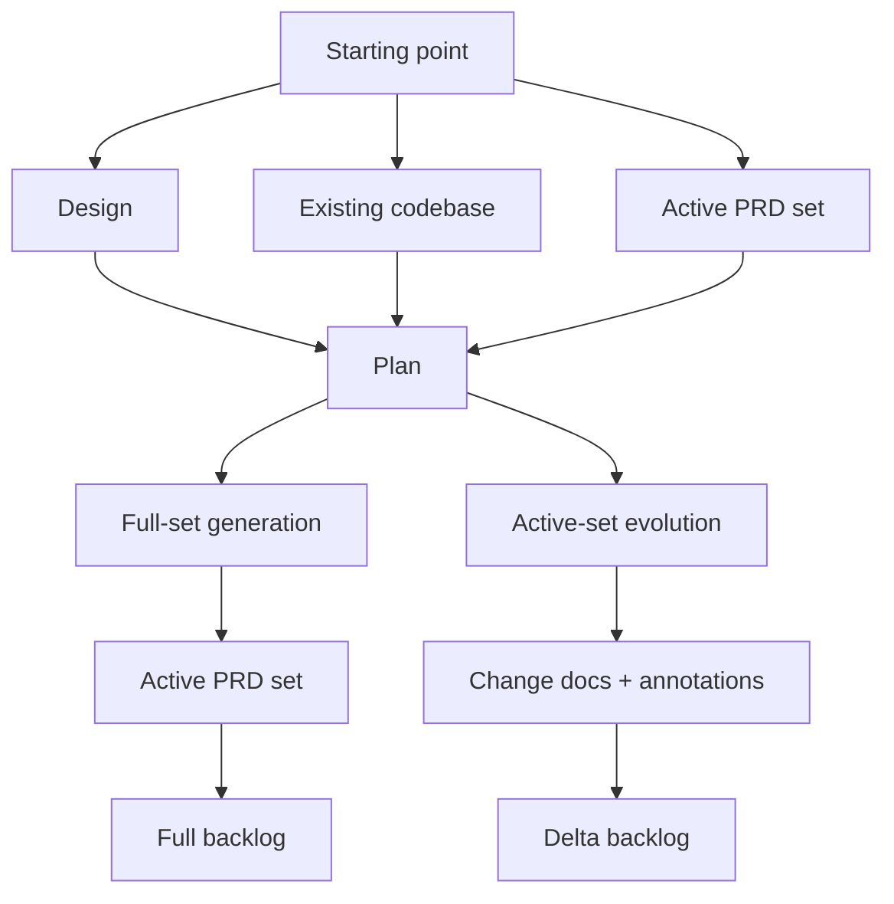

# How Make Docs Stages Fit Together

`make-docs` is not one rigid pipeline. It is a small stage model with a few valid entry points.

The stable idea is:

- designs capture intent
- plans choose the execution route
- PRDs hold the active product requirements
- work backlogs turn those requirements into delivery steps

What changes from project to project is where you enter that model.

## The Four Main Stages

| Stage | Main job | Main output |
| --- | --- | --- |
| Design | Explain what should exist and why | A design doc in `docs/designs/` |
| Plan | Decide the route and expected deliverables | A plan directory in `docs/plans/` |
| PRD | Define or evolve the active product truth | The active PRD namespace in `docs/prd/` |
| Work | Turn the PRD output into delivery work | A work backlog in `docs/work/` |

## The Stage Model in One View

The important distinction is not "did I use planning?" You always plan. The real distinction is whether planning leads to:

- `full-set generation`, or
- `active-set evolution`

## What Full-Set Generation Means

Full-set generation is the route for creating or replacing the active PRD namespace as a set.

This usually happens when:

- the project is new
- the main source is a new design
- the system already exists, but you need a fresh PRD set from the codebase

Typical outputs:

- a plan
- the fixed PRD core plus any needed adaptive PRD docs
- a full work backlog

Decomposition belongs here. It is a route into full-set generation from an existing codebase, not a separate long-term stage that every project carries forever.

## What Active-Set Evolution Means

Active-set evolution is the route for changing part of an already active PRD set.

This is the normal route when:

- the repo already has a trustworthy PRD namespace
- you are adding a capability
- you are enhancing, revising, or removing an existing requirement

Typical outputs:

- a change-oriented plan
- one or more numbered PRD change docs
- `### Change Notes` in affected baseline PRD docs
- an updated `docs/prd/00-index.md`
- a new delta backlog under `docs/work/`

This route keeps the active PRD set in place instead of replacing it.

## Common Entry Points

### Start from a design

Choose this when the main question is intent.

The usual flow is:

1. write or refine the design
2. create the plan
3. generate a full PRD set or a PRD change path
4. create the matching backlog

### Start from an existing codebase

Choose this when the code is the best source of truth.

The usual flow is:

1. inspect the codebase
2. plan decomposition
3. generate a fresh PRD set
4. create a rebuild-oriented backlog

### Start from an active PRD set

Choose this when the product already has active product docs and only part of it is changing.

The usual flow is:

1. identify the change
2. plan the update
3. evolve the PRD set with change docs and annotations
4. create a delta backlog

## How W/R Coordinates Fit In

W/R lineage belongs to plans and work backlogs, not to designs or PRDs.

That means:

- design docs stay date-based
- the active PRD namespace evolves in place
- plans and work directories carry wave and revision lineage

Use [Understanding W/R/P Coordinates](./concepts-wave-revision-phase-coordinates.md) when you need the naming details.

## Practical Mental Model

If you only remember one version of the system, remember this:

- design decides intent
- plan decides route
- PRDs hold the active truth
- work backlogs follow from the PRDs

The route changes, but those jobs stay stable.

## Common Questions

### Do I always need a design first?

No. If the product already exists and the codebase is the real source of truth, decomposition may be the right starting point. If the repo already has an active PRD set, change planning may be the right start.

### Is decomposition separate from PRD generation?

No. It is a route into full-set PRD generation from an existing codebase.

### Does every change require replacing the whole PRD set?

No. Most ongoing product work should use active-set evolution, not full replacement.

## Related Resources

- Use [Choosing the Right Route for Your Project](./workflows-choosing-the-right-route-for-your-project.md) when you want a route chooser rather than the stage overview.
- Use [Installing Make Docs](./getting-started-installing-make-docs.md) when you still need to set up the system in a repo.
- Use the companion developer guide [Understanding the Make Docs Stage Model](../developer/development-workflows-stage-model-and-artifact-relationships.md) for the contributor-facing version of the same model.
